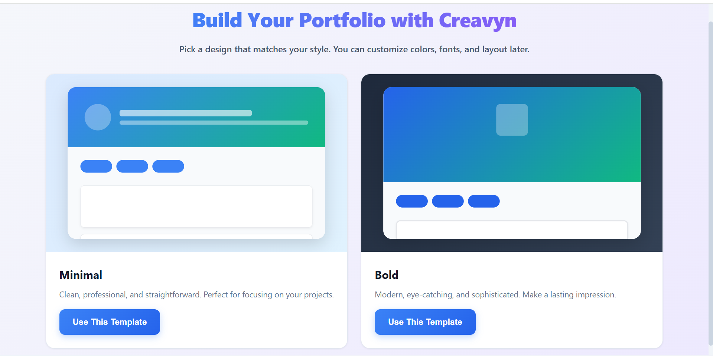
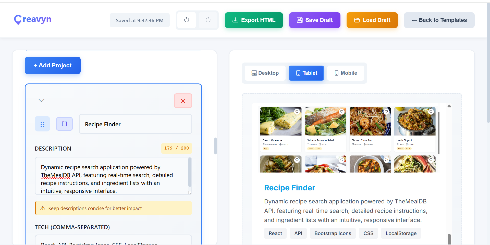
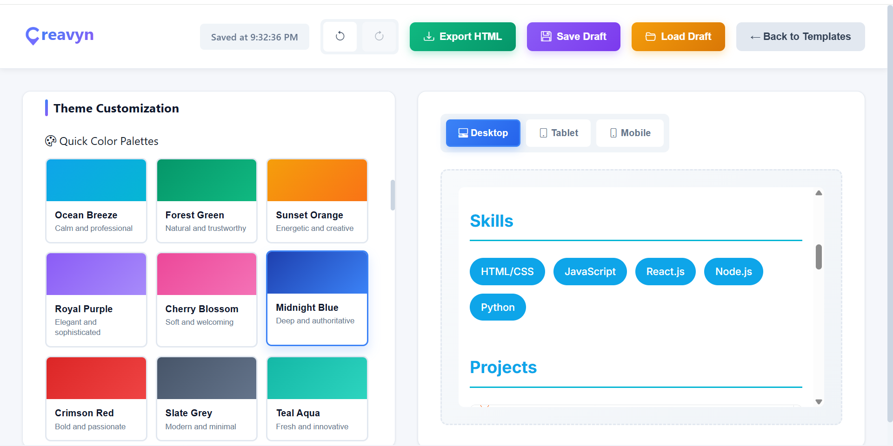
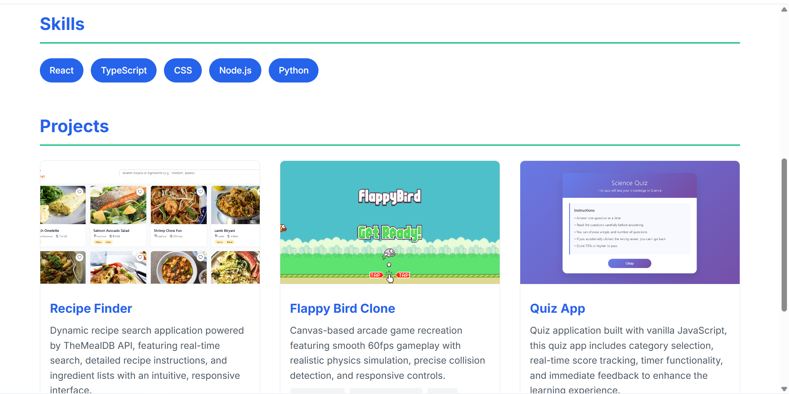

# Creavyn - Portfolio Builder

A modern, intuitive web application that helps developers create beautiful portfolio websites without writing a single line of code. Built with React and designed with user experience in mind.


## Demo

### Screenshots

#### Choose Your Template
Start with one of its professionally designed templates - Minimal or Bold.


#### Build in Real-Time
Edit your portfolio on the left, see changes instantly on the right. Live preview updates as you type.


#### Customize Your Colors
Choose from 10 pre-made color palettes or create your own custom theme.


#### Professional Results
Export a polished, production-ready portfolio. Here's what your final site looks like.


### Live Demo
[View Live Demo](https://creavyn.vercel.app/)


## Features

### Core Functionality
- **Live Preview** - See your portfolio update in real-time as you type
- **Two Beautiful Templates** - Choose between Minimal (clean & professional) or Bold (eye-catching & modern)
- **Device Preview** - Test how your portfolio looks on desktop, tablet, and mobile
- **One-Click Export** - Download your portfolio as a ready-to-deploy HTML file
- **Auto-Save** - Your work is automatically saved every 3 seconds

### Customization
- **Theme Editor** - Customize colors with 10 pre-made palettes or create your own
- **Profile Builder** - Add your name, title, bio, profile image, and contact links
- **Skills Manager** - List your technical skills with easy tag input
- **Project Showcase** - Add unlimited projects with descriptions, tech stacks, screenshots, and links

### Power User Features
- **Undo/Redo** - Full history support with keyboard shortcuts (Ctrl+Z / Ctrl+Shift+Z)
- **Drag & Drop** - Reorder projects by dragging them around
- **Collapse/Expand** - Keep your workspace clean by collapsing project cards
- **Project Duplication** - Clone projects to save time
- **Character Counters** - Visual feedback to keep content concise
- **Save & Load Drafts** - Export your work as JSON and continue later

### Mobile Experience
- **Responsive Design** - Works perfectly on phones, tablets, and desktops
- **Mobile Menu** - Clean hamburger menu that saves screen space
- **Touch-Friendly** - All buttons and controls optimized for mobile devices


## Getting Started

### Prerequisites
- Node.js 16+ and npm installed on your machine

### Installation

1. Clone this repository:
```bash
git clone https://github.com/jericho066/creavyn.git
cd creavyn
```

2. Install dependencies:
```bash
npm install
```

3. Start the development server:
```bash
npm run dev
```

4. Open your browser and navigate to `http://localhost:5173`

### Building for Production
```bash
npm run build
```


## How to Use

1. **Choose a Template** - Start by selecting either the Minimal or Bold template
2. **Fill in Your Details** - Add your profile information, skills, and contact links
3. **Add Projects** - Showcase your work with project cards (title, description, tech stack, links, screenshots)
4. **Customize Theme** - Pick from 10 color palettes or create your own custom colors
5. **Preview** - Check how your portfolio looks on different devices
6. **Export** - Download your portfolio as an HTML file and README


## Tech Stack

- **React 18** - UI library
- **Vite** - Build tool and dev server
- **React Router** - Client-side routing
- **CSS** - Pure CSS for styling
- **Bootstrap Icons** - For iconography
- **LocalStorage** - Draft persistence
- **UUID** - Unique project IDs
- **JSZip** - Future ZIP export functionality
